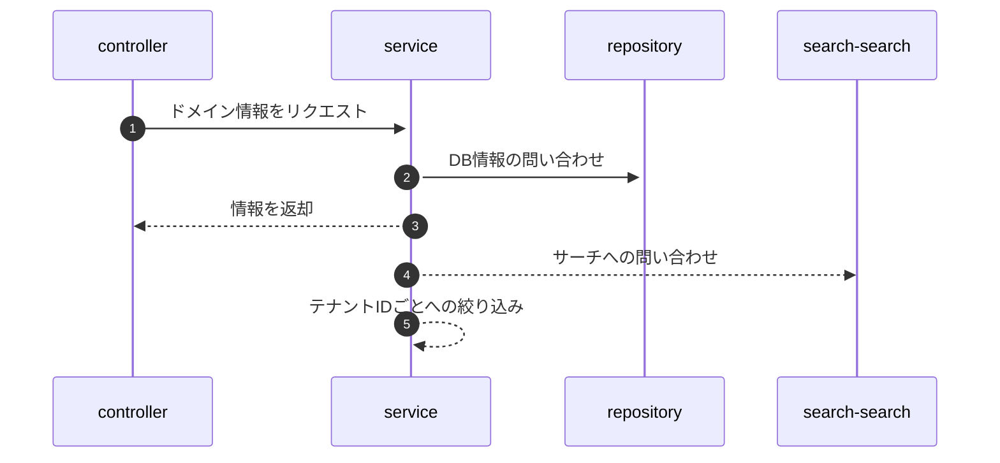
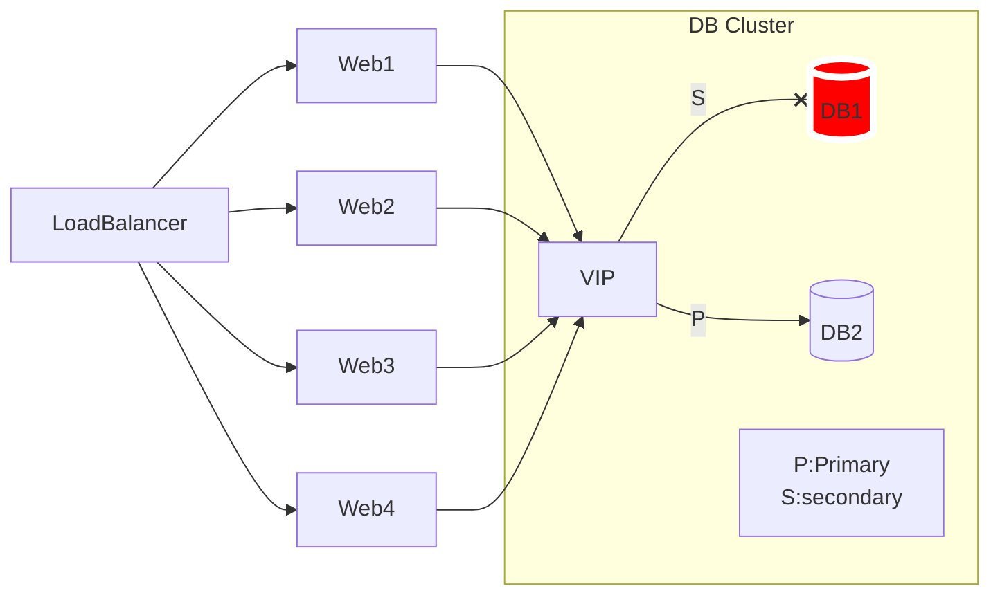
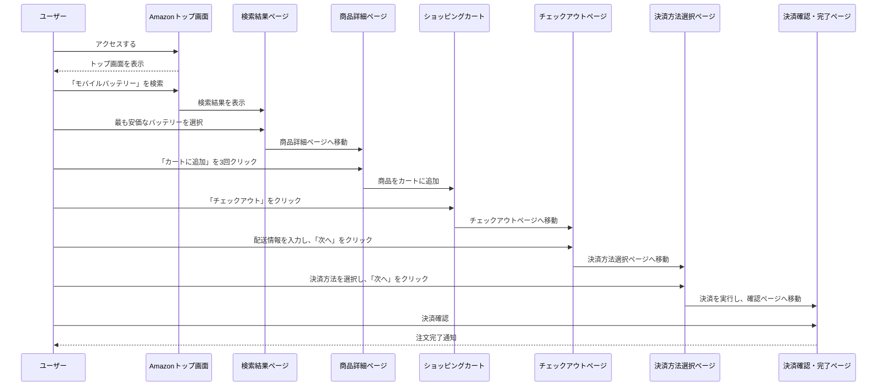

以下にDBとの関係を示す。

```mermaid
sequenceDiagram
autonumber
participant controller as controller
participant service as service
participant repository as repository
participant serch-service as search-search
    controller ->>+ service: ドメイン情報をリクエスト
    service ->>+ repository: DB情報の問い合わせ
    service -->> controller:情報を返却 
    service -->> serch-service: サーチへの問い合わせ
    service -->> service: テナントIDごとへの絞り込み
```

障害時の関係図は以下のようである。

```mermaid
flowchart LR
    LB[LoadBalancer]
    LB --> A[Web1]
    LB --> B[Web2]
    LB --> C[Web3]
    LB --> D[Web4]
    A --> VIP
    B --> VIP
    C --> VIP
    D --> VIP
    subgraph "DB Cluster"
        VIP -- S --x DB1[(DB1)]
        VIP -- P --> DB2[(DB2)]
        Annotation[P:Primary<br>S:secondary]
    end

    classDef classA fill:#f00,stroke:#fff,stroke-width:5px;
    class DB1 classA;
```

``` mermaid
sequenceDiagram
 participant User as ユーザー
   participant AmazonHome as Amazonトップ画面
   participant SearchResult as 検索結果ページ
   participant ProductPage as 商品詳細ページ　#ここを追加
   participant ShoppingCart as ショッピングカート　#ここを追加
   participant CheckoutPage as チェックアウトページ　#ここを追加
   participant PaymentSelection as 決済方法選択ページ　#ここを追加
   participant PaymentConfirmation as 決済確認・完了ページ　#ここを追加

   User->>AmazonHome: アクセスする
   AmazonHome-->>User: トップ画面を表示
   User->>AmazonHome: 「モバイルバッテリー」を検索
   AmazonHome->>SearchResult: 検索結果を表示
   User->>SearchResult: 最も安価なバッテリーを選択　#ここを追加
   SearchResult->>ProductPage: 商品詳細ページへ移動　#ここを追加
   User->>ProductPage: 「カートに追加」を3回クリック　#ここを追加
   ProductPage->>ShoppingCart: 商品をカートに追加　#ここを追加
   User->>ShoppingCart: 「チェックアウト」をクリック　#ここを追加
   ShoppingCart->>CheckoutPage: チェックアウトページへ移動　#ここを追加
   User->>CheckoutPage: 配送情報を入力し、「次へ」をクリック　#ここを追加
   CheckoutPage->>PaymentSelection: 決済方法選択ページへ移動　#ここを追加
   User->>PaymentSelection: 決済方法を選択し、「次へ」をクリック　#ここを追加
   PaymentSelection->>PaymentConfirmation: 決済を実行し、確認ページへ移動　#ここを追加
   User->>PaymentConfirmation: 決済確認　#ここ追加
   PaymentConfirmation-->>User: 注文完了通知　#ここ追加
```
